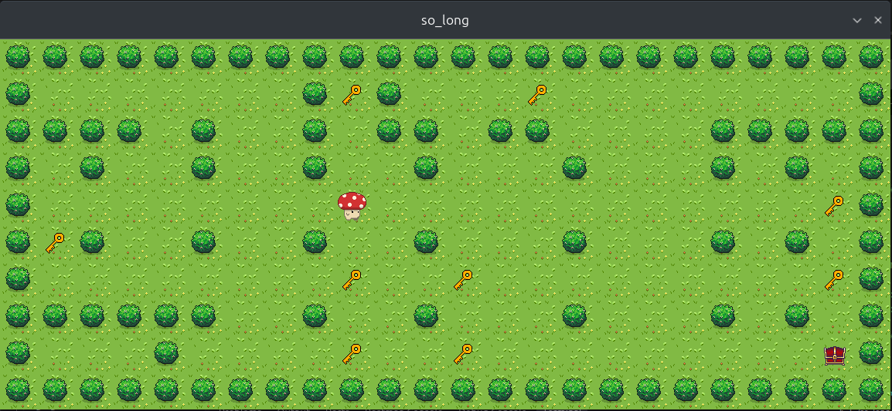

# so_long

`so_long` is a small 2D tile-based game built in C with MiniLibX for the 42
curriculum. Guide the mushroom through the map, collect every key, and reach the
chest using as few moves as possible.



## Gameplay

- Move with `W`, `A`, `S`, `D` or the arrow keys.
- Collect every key to unlock the chest.
- Reach the open chest to win.
- Press `Esc` or close the window to exit.

The current move count is printed in the terminal.

## Build

The project targets Linux and requires a C compiler, `make`, X11, and Xext. It
expects MiniLibX, Libft, and ft_printf in the directories referenced by the
`Makefile`.

On Debian or Ubuntu, the graphical dependencies can be installed with:

```sh
sudo apt install build-essential libx11-dev libxext-dev
```

Build the game from the repository root:

```sh
make
```

## Run

Pass a valid `.ber` map to the executable:

```sh
./so_long map.ber
```

A valid map must be rectangular, surrounded by walls, and contain exactly one
player (`P`), one exit (`E`), and at least one collectible (`C`). Every
collectible and the exit must be reachable.

## Map symbols

| Symbol | Meaning |
| --- | --- |
| `0` | Empty floor |
| `1` | Wall |
| `P` | Player start |
| `C` | Collectible |
| `E` | Exit |
